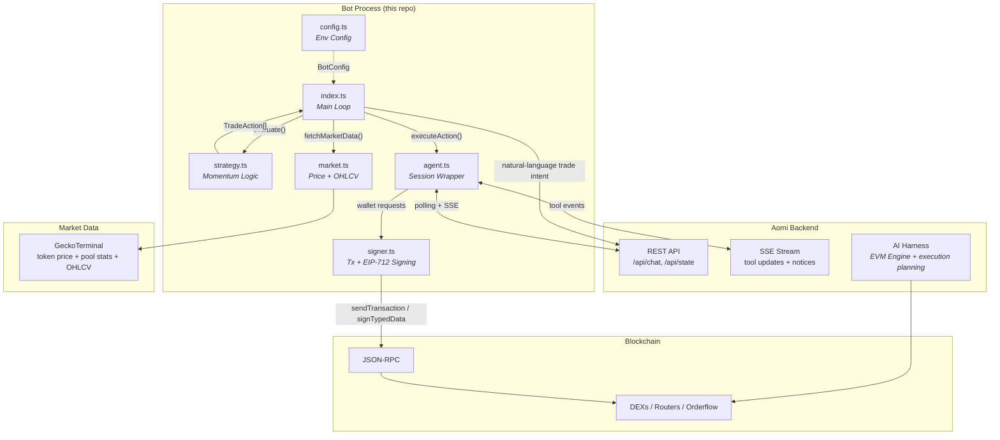
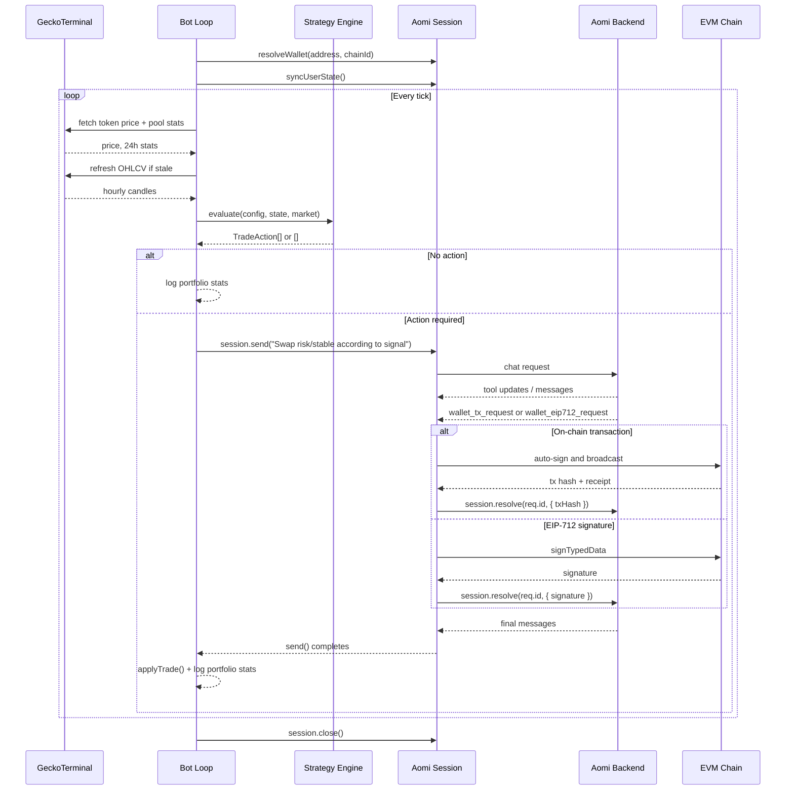

# Aomi Client Example

[](./LICENSE) [](https://www.npmjs.com/package/@aomi-labs/client) [](https://www.typescriptlang.org/)

> Example trading bot showing how to integrate `@aomi-labs/client` — the TypeScript SDK for Aomi, open-source AI blockchain infrastructure for executing on-chain transactions.

## What is this?

This repository is a reference implementation built on `@aomi-labs/client`, the TypeScript SDK for Aomi — open-source AI blockchain infrastructure for executing on-chain transactions. The bot rotates between a risk asset and a stable asset using moving-average signals, sending natural-language trade instructions to the Aomi backend and auto-signing the resulting on-chain transactions and EIP-712 payloads locally.

This repo shows how to:

- run portfolio logic locally
- send natural-language trade instructions to the Aomi backend
- auto-sign on-chain transaction requests with `viem`
- auto-sign EIP-712 payloads for flows like CoW Swap

The current bot rotates between a configured risk asset and a stable asset in allocation steps based on moving-average signals.

## What The Bot Does

The bot does not call DEX contracts directly.

Instead:

1. it fetches market data
2. it decides the next allocation state locally
3. it asks the Aomi agent to execute the trade
4. it auto-signs any wallet request emitted by the session
5. it tracks portfolio state and logs results

Current allocation buckets:

- `full_risk`
- `reduced_risk`
- `mostly_stable`
- `full_stable`

## Architecture



## Sequence Diagram



## Current Strategy

The strategy in [`src/strategy.ts`](/Users/cecilia/test-aomi-client/aomi-client-example/src/strategy.ts) is a simple momentum rotation model:

- fast MA well above slow MA: stay `full_risk`
- positive but weakening spread: trim to `reduced_risk`
- fast MA below slow MA: move to `mostly_stable`
- strongly negative spread: move to `full_stable`
- if drawdown exceeds `MAX_DRAWDOWN`, trigger `emergency_exit`

Only one step is taken at a time, and `TRADE_COOLDOWN_MS` prevents immediate churn.

## Market Data

[`src/market.ts`](/Users/cecilia/test-aomi-client/aomi-client-example/src/market.ts) currently uses GeckoTerminal for:

- token price by `RISK_ASSET_ADDRESS`
- pool-level 24h stats by `OHLCV_POOL_ADDRESS`
- hourly OHLCV candles for the slow moving average

Behavior today:

- price samples are stored in memory for the fast MA
- OHLCV is cached and refreshed every `OHLCV_REFRESH_MS`
- GeckoTerminal 429s are retried with backoff
- if OHLCV refresh fails, cached candles are reused

## Execution And Signing

[`src/agent.ts`](/Users/cecilia/test-aomi-client/aomi-client-example/src/agent.ts) wraps `Session` from `@aomi-labs/client`.

The bot:

- creates a session with `app`, `publicKey`, and wallet `userState`
- calls `resolveWallet(...)` so the session knows the wallet address and chain
- sends messages with blocking `session.send(...)`
- auto-handles `wallet_tx_request`
- auto-handles `wallet_eip712_request`

Signing is local:

- transactions are broadcast with `viem` in [`src/signer.ts`](/Users/cecilia/test-aomi-client/aomi-client-example/src/signer.ts)
- EIP-712 payloads are signed with `wallet.signTypedData(...)`

When a wallet request arrives, the bot logs messages like:

```text
[bot] Auto-signing ERC-20 approval transaction...
[signer] Tx request id=...
[signer] Tx broadcast: 0x...
[bot] Auto-sign complete: ERC-20 approval transaction.
```

## Quick Start

```bash
pnpm install
cp .env.example .env
pnpm start
```

For watch mode:

```bash
pnpm dev
```

## Required Setup

Edit `.env` based on [`.env.example`](/Users/cecilia/test-aomi-client/aomi-client-example/.env.example).

Minimum required values:

```env
AOMI_BASE_URL=https://aomi.dev
AOMI_API_KEY=your-api-key
AOMI_APP=default

PRIVATE_KEY=0x...
RPC_URL=https://eth.llamarpc.com
CHAIN_ID=1

RISK_ASSET=wSOL
RISK_ASSET_ADDRESS=0x...
STABLE_ASSET=USDC
STABLE_ASSET_ADDRESS=0x...

GECKO_NETWORK=eth
OHLCV_POOL_ADDRESS=0x...
```

## Configuration

[`src/config.ts`](/Users/cecilia/test-aomi-client/aomi-client-example/src/config.ts) loads the following env vars.

### Aomi

- `AOMI_BASE_URL`
- `AOMI_API_KEY`
- `AOMI_APP`
- `PUBLIC_KEY`

### Wallet / Chain

- `PRIVATE_KEY`
- `RPC_URL`
- `CHAIN_ID`

Supported chain labels in code today:

- `1` -> Ethereum mainnet
- `42161` -> Arbitrum
- `8453` -> Base
- `10` -> Optimism
- `137` -> Polygon

### Trading Pair

- `RISK_ASSET`
- `RISK_ASSET_ADDRESS`
- `STABLE_ASSET`
- `STABLE_ASSET_ADDRESS`

### Market Data

- `GECKO_NETWORK`
- `OHLCV_POOL_ADDRESS`
- `OHLCV_REFRESH_MS`

### Strategy

- `FAST_MA_PERIOD`
- `SLOW_MA_PERIOD`
- `MA_SPREAD_THRESHOLD`
- `MAX_SLIPPAGE`
- `MAX_DRAWDOWN`
- `TRADE_COOLDOWN_MS`

### Starting Portfolio

- `INITIAL_RISK_AMOUNT`
- `INITIAL_STABLE_AMOUNT`

### Bot Runtime

- `LOOP_INTERVAL_MS`
- `DEBUG`

## Project Structure

```text
src/
  index.ts      Main loop
  config.ts     Env loading and chain labels
  types.ts      Shared types
  strategy.ts   Momentum allocation logic
  market.ts     GeckoTerminal price, stats, and OHLCV fetchers
  agent.ts      Aomi session wrapper and auto-sign handlers
  signer.ts     viem wallet client + tx/EIP-712 signing
scripts/
  link-client.mjs
```

## Using @aomi-labs/client Yourself

This repo's integration pattern is:

```ts
import {
  Session,
  type WalletRequest,
  type WalletTxPayload,
} from "@aomi-labs/client";

const session = new Session(
  { baseUrl: process.env.AOMI_BASE_URL!, apiKey: process.env.AOMI_API_KEY },
  {
    app: process.env.AOMI_APP ?? "default",
    publicKey: walletAddress,
    userState: { address: walletAddress, chainId: 1 },
  },
);

session.resolveWallet(walletAddress, 1);

session.on("wallet_tx_request", async (req: WalletRequest) => {
  const payload = req.payload as WalletTxPayload;
  const txHash = await walletClient.sendTransaction({
    account,
    to: payload.to as `0x${string}`,
    data: payload.data as `0x${string}` | undefined,
    value: payload.value ? BigInt(payload.value) : undefined,
  });

  await session.resolve(req.id, { txHash });
});

const result = await session.send("Swap 500 USDC for ETH on Ethereum mainnet.");
console.log(result.messages);
```

If you need gasless order flows or permits, also register `wallet_eip712_request` and resolve with `{ signature }`.

## Notes

- The bot's portfolio state is tracked locally after each executed action.
- The trade prompt is natural language; route selection is delegated to the Aomi agent.
- The current code logs market, action, and portfolio lines on every loop.
- Graceful shutdown prints a final portfolio report.
