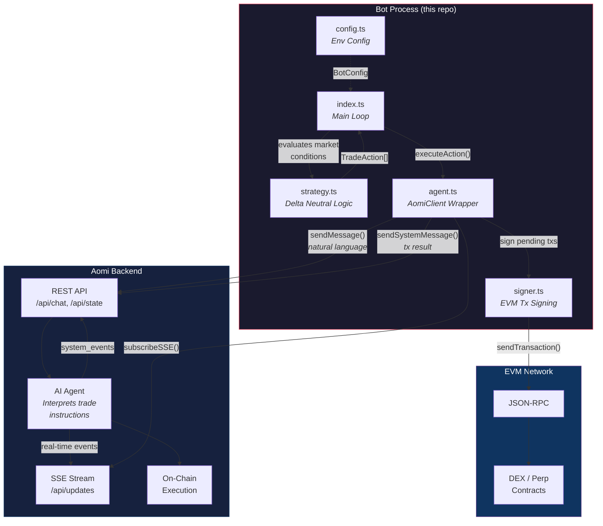
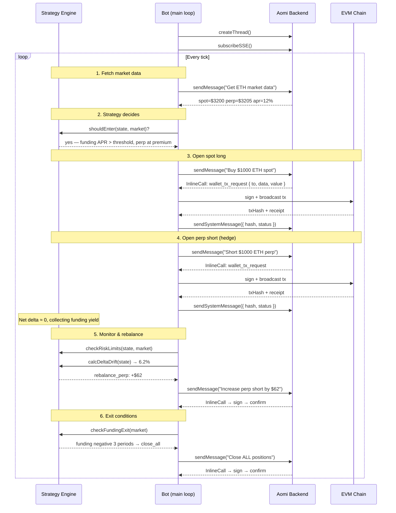

# aomi-client-example

A delta neutral trading bot built with [`@aomi-labs/client`](https://www.npmjs.com/package/@aomi-labs/client) — demonstrating how to use the Aomi client to build autonomous on-chain bots.

## How It Works

This bot does **not** call DEX contracts directly. Instead, it uses the Aomi client to communicate with an AI agent backend that handles on-chain execution. The bot is the **brain** (strategy logic), and the Aomi agent is the **hands** (trade execution).

The core loop:

1. Bot decides what to do (buy spot, short perp, rebalance, etc.)
2. Bot sends a natural-language instruction via `client.sendMessage()`
3. Aomi backend agent interprets it and prepares an on-chain transaction
4. Agent returns the unsigned tx as an `InlineCall` system event (`wallet_tx_request`)
5. Bot signs it locally with a private key (via `viem`) and broadcasts
6. Bot sends the tx hash back to the agent via `client.sendSystemMessage()`

## Architecture



## Sequence Diagram



## Using `@aomi-labs/client` in Your Own Bot

The Aomi client is a platform-agnostic TypeScript client for the Aomi backend API. Here's how to use it:

### 1. Install

```bash
pnpm add @aomi-labs/client
```

### 2. Create a Client

```typescript
import { AomiClient } from "@aomi-labs/client";

const client = new AomiClient({
  baseUrl: "https://aomi.dev",
  apiKey: "your-api-key",       // optional, for non-default namespaces
  logger: console,              // optional, for debug output
});
```

### 3. Create a Session

Every conversation with the agent lives in a session (thread). You generate the ID client-side:

```typescript
const threadId = `my-bot-${Date.now()}`;
const thread = await client.createThread(threadId, "0xYourWalletAddress");
const sessionId = thread.session_id;
```

### 4. Send Messages

Send natural language instructions. The agent interprets them and acts:

```typescript
const response = await client.sendMessage(sessionId, "Buy $500 of ETH spot", {
  namespace: "default",
  publicKey: "0xYourWalletAddress",
  userState: { address: "0x..." },  // pass wallet info
});

// response.messages    — chat messages from the agent
// response.system_events — InlineCalls, notices, errors
// response.is_processing — whether the agent is still working
```

### 5. Handle System Events (Transaction Signing)

When the agent needs you to sign a transaction, it sends an `InlineCall`:

```typescript
import { isInlineCall, isSystemNotice, isSystemError } from "@aomi-labs/client";

for (const event of response.system_events ?? []) {
  if (isInlineCall(event) && event.InlineCall.type === "wallet_tx_request") {
    const { payload } = event.InlineCall;
    // payload contains: { to, value, data, chainId, ... }

    // Sign and broadcast with your wallet (viem, ethers, etc.)
    const hash = await walletClient.sendTransaction(payload);

    // Report the result back to the agent
    await client.sendSystemMessage(sessionId, JSON.stringify({
      type: "wallet_tx_result",
      hash,
      status: "success",
    }));
  }
}
```

### 6. Subscribe to Real-Time Updates (SSE)

For long-running operations, subscribe to server-sent events:

```typescript
const unsubscribe = client.subscribeSSE(
  sessionId,
  (event) => {
    // event.type: "title_changed" | "tool_update" | "tool_complete" | "system_notice"
    console.log("SSE event:", event.type, event);
  },
  (error) => console.error("SSE error:", error),
);

// Later: unsubscribe()
```

### 7. Poll for Completion

If the agent is still processing after `sendMessage`, poll until done:

```typescript
if (response.is_processing) {
  let state;
  do {
    await new Promise((r) => setTimeout(r, 2000));
    state = await client.fetchState(sessionId);
  } while (state.is_processing);
}
```

### 8. Session Management

```typescript
// List all threads for a wallet
const threads = await client.listThreads("0xYourAddress");

// Rename, archive, delete
await client.renameThread(sessionId, "My Trading Session");
await client.archiveThread(sessionId);
await client.deleteThread(sessionId);
```

### Full API Reference

| Method | Description |
|---|---|
| `createThread(id, publicKey?)` | Create a new session |
| `sendMessage(sessionId, message, opts?)` | Send a chat message |
| `sendSystemMessage(sessionId, message)` | Send system data (tx results, state changes) |
| `fetchState(sessionId)` | Get current session state |
| `interrupt(sessionId)` | Interrupt agent processing |
| `subscribeSSE(sessionId, onUpdate, onError?)` | Real-time event stream |
| `listThreads(publicKey)` | List all sessions |
| `getThread(sessionId)` | Get a single thread |
| `deleteThread(sessionId)` | Delete a thread |
| `renameThread(sessionId, title)` | Rename a thread |
| `archiveThread(sessionId)` | Archive a thread |
| `unarchiveThread(sessionId)` | Unarchive a thread |
| `getSystemEvents(sessionId, count?)` | Fetch system events |
| `getNamespaces(sessionId, opts?)` | List available namespaces |
| `getModels(sessionId)` | List available models |
| `setModel(sessionId, rig, opts?)` | Set model for session |

## Quick Start

```bash
git clone <this-repo>
cd aomi-client-demo
pnpm install
cp .env.example .env
```

Edit `.env`:

```env
AOMI_BASE_URL=https://aomi.dev
AOMI_API_KEY=your-key
PRIVATE_KEY=0xYourPrivateKeyHex
RPC_URL=https://arb1.arbitrum.io/rpc
CHAIN_ID=42161
TOKEN=ETH
POSITION_SIZE_USD=1000
```

Run:

```bash
pnpm start
```

## Project Structure

```
src/
  index.ts      Main loop — wires strategy + agent + signer
  config.ts     Environment-based configuration
  types.ts      Shared types (Position, StrategyState, TradeAction, MarketData)
  strategy.ts   Pure strategy logic (entry, rebalance, risk, funding checks)
  agent.ts      AomiClient wrapper (chat, SSE, tx signing flow)
  signer.ts     EVM transaction signing via viem
```

## Strategy: Delta Neutral

| Phase | What happens |
|---|---|
| **Entry** | Buy spot long + short equal-sized perp when funding rate APR > threshold and perp is at a premium |
| **Yield** | Collect funding rate payments every period (shorts get paid when funding > 0) |
| **Rebalance** | When delta drift exceeds 5%, adjust leg sizes to restore neutrality |
| **Exit** | Close all when: funding flips negative for 3+ periods, max drawdown breached, or stop loss hit |

## Configuration

| Env Var | Default | Description |
|---|---|---|
| `AOMI_BASE_URL` | `https://aomi.dev` | Aomi backend URL |
| `AOMI_API_KEY` | — | API key for non-default namespaces |
| `AOMI_NAMESPACE` | `default` | Agent namespace |
| `PUBLIC_KEY` | — | Wallet public key |
| `PRIVATE_KEY` | *required* | EVM private key (0x-prefixed hex) |
| `RPC_URL` | `https://eth.llamarpc.com` | JSON-RPC endpoint |
| `CHAIN_ID` | `1` | 1=mainnet, 42161=arbitrum, 8453=base, 10=optimism, 137=polygon |
| `TOKEN` | `SOL` | Token to trade |
| `POSITION_SIZE_USD` | `1000` | USD size per leg |
| `REBALANCE_THRESHOLD` | `0.05` | Delta drift threshold (5%) |
| `MIN_FUNDING_RATE_APR` | `5` | Min funding APR % to enter |
| `MAX_POSITION_USD` | `10000` | Max total position |
| `MAX_DRAWDOWN` | `0.10` | Max drawdown before emergency exit (10%) |
| `LOOP_INTERVAL_MS` | `60000` | Strategy loop interval |
| `DEBUG` | `false` | Verbose logging |

## Supported Chains

Built-in chain configs via viem: Ethereum Mainnet (1), Arbitrum (42161), Optimism (10), Base (8453), Polygon (137). Any other chain ID works with a custom RPC URL.

## License

ISC
