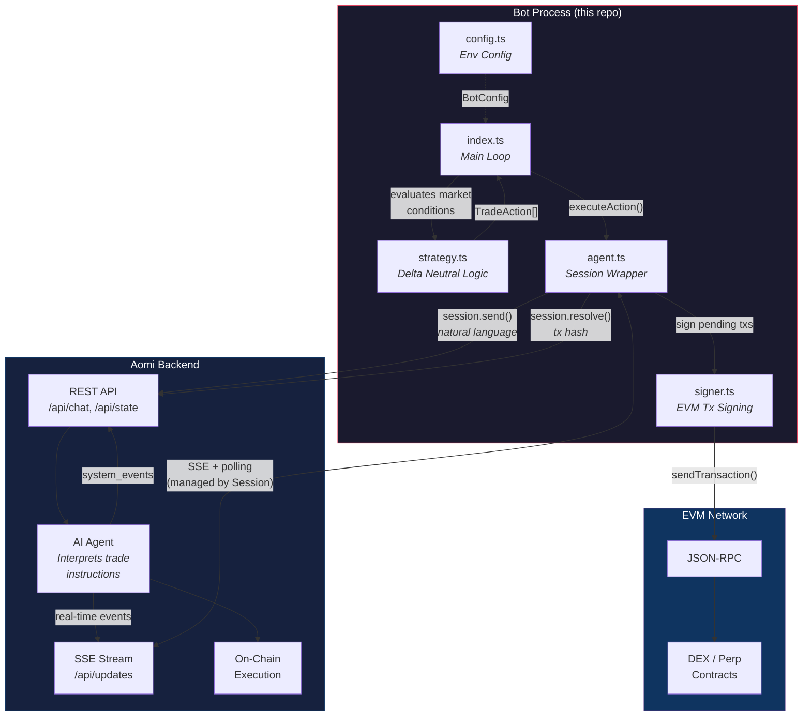
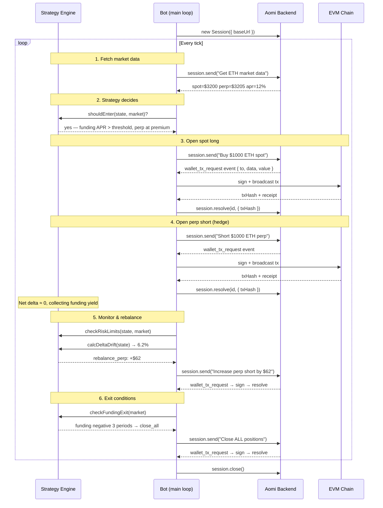

# aomi-client-example

A delta neutral trading bot built with [`@aomi-labs/client`](https://www.npmjs.com/package/@aomi-labs/client) — demonstrating how to use the Aomi client to build autonomous on-chain bots.

## How It Works

This bot does **not** call DEX contracts directly. Instead, it uses the Aomi client's `Session` class to communicate with an AI agent backend that handles on-chain execution. The bot is the **brain** (strategy logic), and the Aomi agent is the **hands** (trade execution).

The core loop:

1. Bot decides what to do (buy spot, short perp, rebalance, etc.)
2. Bot sends a natural-language instruction via `session.send()`
3. Aomi backend agent interprets it and prepares an on-chain transaction
4. Session emits a `wallet_tx_request` event with the unsigned transaction
5. Bot signs it locally with a private key (via `viem`) and calls `session.resolve()`
6. Agent receives the tx hash and continues

## Architecture



## Sequence Diagram



## Using `@aomi-labs/client` in Your Own Bot

The Aomi client provides a high-level `Session` class that handles polling, SSE, and wallet request lifecycle for you.

### 1. Install

```bash
pnpm add @aomi-labs/client
```

### 2. Create a Session

```typescript
import { Session } from "@aomi-labs/client";

const session = new Session(
  { baseUrl: "https://aomi.dev", apiKey: "your-api-key" },
  {
    namespace: "default",
    publicKey: "0xYourWalletAddress",
    userState: { address: "0xYourWalletAddress" },
  },
);
```

### 3. Handle Wallet Requests

Register event handlers for transaction signing **before** sending messages:

```typescript
import type { WalletRequest, WalletTxPayload } from "@aomi-labs/client";

session.on("wallet_tx_request", async (req: WalletRequest) => {
  const payload = req.payload as WalletTxPayload;
  // payload: { to, value?, data?, chainId? }

  try {
    // Sign and broadcast with your wallet (viem, ethers, etc.)
    const hash = await walletClient.sendTransaction({
      to: payload.to,
      data: payload.data,
      value: payload.value ? BigInt(payload.value) : undefined,
    });

    // Report success back to the agent
    await session.resolve(req.id, { txHash: hash });
  } catch (err) {
    // Report failure
    await session.reject(req.id, err.message);
  }
});
```

### 4. Send Messages

`session.send()` is blocking — it waits for the AI agent to finish processing:

```typescript
const result = await session.send("Buy $500 of ETH spot");

// result.messages — chat messages from the agent
// result.title    — session title (if set)
```

### 5. Listen for Other Events

```typescript
session.on("system_notice", ({ message }) => console.log("Notice:", message));
session.on("system_error", ({ message }) => console.error("Error:", message));
session.on("processing_start", () => console.log("Agent is thinking..."));
session.on("processing_end", () => console.log("Agent done."));
```

### 6. Clean Up

```typescript
session.close(); // stops polling, unsubscribes SSE
```

### Session API Reference

| Method / Property | Description |
|---|---|
| `new Session(clientOpts, sessionOpts)` | Create a new session with managed polling + SSE |
| `session.send(message)` | Send message, wait for agent to finish (blocking) |
| `session.sendAsync(message)` | Send message, return immediately |
| `session.resolve(reqId, result)` | Resolve a wallet request with `{ txHash }` or `{ signature }` |
| `session.reject(reqId, reason?)` | Reject a wallet request |
| `session.interrupt()` | Cancel agent's current response |
| `session.close()` | Close session, stop polling |
| `session.on(event, handler)` | Listen for events (wallet requests, notices, errors, etc.) |
| `session.getMessages()` | Get current message history |
| `session.getPendingRequests()` | Get pending wallet requests |
| `session.getIsProcessing()` | Check if agent is processing |
| `session.sessionId` | The session ID |

## Quick Start

```bash
git clone https://github.com/aomi-labs/aomi-client-example.git
cd aomi-client-example
pnpm install
cp .env.example .env
```

Edit `.env`:

```env
AOMI_BASE_URL=https://aomi.dev
AOMI_API_KEY=your-key
PRIVATE_KEY=0xYourPrivateKeyHex
RPC_URL=https://arb1.arbitrum.io/rpc
CHAIN_ID=42161
TOKEN=ETH
POSITION_SIZE_USD=1000
```

Run:

```bash
pnpm start
```

## Project Structure

```
src/
  index.ts      Main loop — wires strategy + agent + signer
  config.ts     Environment-based configuration
  types.ts      Shared types (Position, StrategyState, TradeAction, MarketData)
  strategy.ts   Pure strategy logic (entry, rebalance, risk, funding checks)
  agent.ts      Session wrapper (chat, wallet signing via events)
  signer.ts     EVM transaction signing via viem
```

## Strategy: Delta Neutral

| Phase | What happens |
|---|---|
| **Entry** | Buy spot long + short equal-sized perp when funding rate APR > threshold and perp is at a premium |
| **Yield** | Collect funding rate payments every period (shorts get paid when funding > 0) |
| **Rebalance** | When delta drift exceeds 5%, adjust leg sizes to restore neutrality |
| **Exit** | Close all when: funding flips negative for 3+ periods, max drawdown breached, or stop loss hit |

## Configuration

| Env Var | Default | Description |
|---|---|---|
| `AOMI_BASE_URL` | `https://aomi.dev` | Aomi backend URL |
| `AOMI_API_KEY` | — | API key for non-default namespaces |
| `AOMI_NAMESPACE` | `default` | Agent namespace |
| `PUBLIC_KEY` | — | Wallet public key |
| `PRIVATE_KEY` | *required* | EVM private key (0x-prefixed hex) |
| `RPC_URL` | `https://eth.llamarpc.com` | JSON-RPC endpoint |
| `CHAIN_ID` | `1` | 1=mainnet, 42161=arbitrum, 8453=base, 10=optimism, 137=polygon |
| `TOKEN` | `SOL` | Token to trade |
| `POSITION_SIZE_USD` | `1000` | USD size per leg |
| `REBALANCE_THRESHOLD` | `0.05` | Delta drift threshold (5%) |
| `MIN_FUNDING_RATE_APR` | `5` | Min funding APR % to enter |
| `MAX_POSITION_USD` | `10000` | Max total position |
| `MAX_DRAWDOWN` | `0.10` | Max drawdown before emergency exit (10%) |
| `LOOP_INTERVAL_MS` | `60000` | Strategy loop interval |
| `DEBUG` | `false` | Verbose logging |

## Supported Chains

Built-in chain configs via viem: Ethereum Mainnet (1), Arbitrum (42161), Optimism (10), Base (8453), Polygon (137). Any other chain ID works with a custom RPC URL.

## License

ISC
